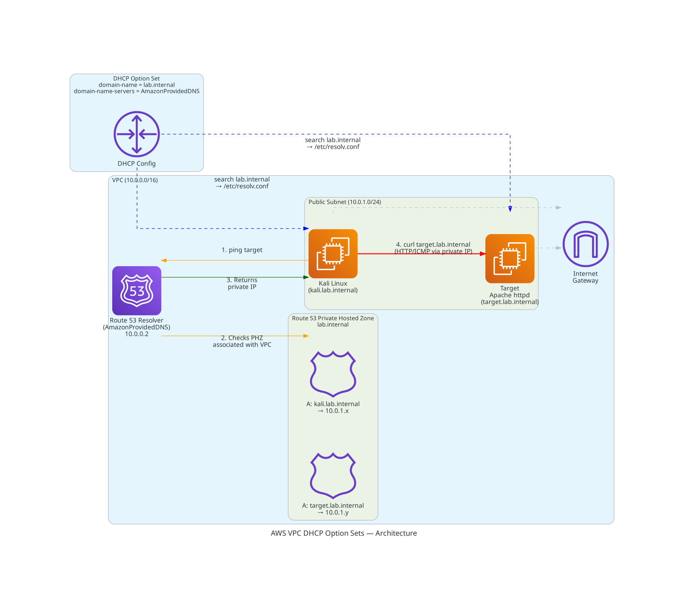

# AWS VPC DHCP Option Sets — Terraform

Deploy a custom DHCP option set in AWS with a Route 53 private hosted zone for instance-to-instance DNS resolution. Includes a Kali Linux attacker instance and an Apache web server target reachable by name (`target.lab.internal`).

## Architecture



## Prerequisites

| Tool | Version |
|------|---------|
| Terraform | >= 1.5.0 |
| AWS CLI | v2 |
| AWS Account | With VPC/EC2 permissions |

## Quick Start

```bash
# 1. Clone the repo
git clone <REPO_URL> && cd "AWS VPC DHCP Option Sets"

# 2. Configure variables
cp terraform.tfvars.example terraform.tfvars
# Edit terraform.tfvars — set allowed_ssh_cidr to your IP

# 3. Deploy
terraform init
terraform plan
terraform apply

# 4. Connect to Kali
ssh -i dhcp-demo-key.pem kali@<KALI_PUBLIC_IP>

# 5. Verify DHCP settings
cat /etc/resolv.conf
hostname -f

# 6. Resolve and reach the target by name
ping -c 3 target.lab.internal
curl target.lab.internal

# 6. Destroy when done
terraform destroy
```

## File Structure

```
AWS VPC DHCP Option Sets/
├── main.tf                  # VPC, DHCP option set, subnet, SG, EC2
├── variables.tf             # Input variables
├── outputs.tf               # Useful outputs (IPs, SSH command)
├── providers.tf             # AWS provider configuration
├── terraform.tfvars.example # Example variable values
├── .gitignore               # Ignore state, keys, lock files
└── README.md                # This file
```

## Variables

| Name | Description | Default |
|------|-------------|---------|
| `aws_region` | AWS region to deploy into | `eu-west-2` |
| `project_name` | Project name for resource naming | `dhcp-demo` |
| `vpc_cidr` | CIDR block for the VPC | `10.0.0.0/16` |
| `public_subnet_cidr` | CIDR block for the public subnet | `10.0.1.0/24` |
| `custom_domain_name` | Custom domain name for DHCP and Route 53 PHZ | `lab.internal` |
| `dns_servers` | DNS server IPs | `["AmazonProvidedDNS"]` |
| `kali_ami_id` | Kali Linux Marketplace AMI ID (eu-west-2) | `ami-0169343dd7b12ae72` |
| `kali_instance_type` | EC2 instance type for Kali | `t3.medium` |
| `instance_type` | EC2 instance type for the target | `t3.micro` |
| `allowed_ssh_cidr` | CIDR allowed to SSH | — (required) |

## What This Deploys

1. VPC with DNS support and DNS hostnames enabled
2. Custom DHCP option set — sets `domain-name = lab.internal` and `domain-name-servers = AmazonProvidedDNS`
3. DHCP options association to the VPC
4. Route 53 private hosted zone (`lab.internal`) with A records for each instance
5. Public subnet with internet gateway and route table
6. Security group — SSH from your IP, all traffic within the VPC
7. SSH key pair (generated locally)
8. Kali Linux instance (AWS Marketplace AMI, `t3.medium`) — SSH user: `kali`
9. Target instance (Amazon Linux 2023, `t3.micro`) — runs Apache httpd on port 80

## Security Considerations

- SSH access restricted to your specified CIDR block
- IMDSv2 enforced on both EC2 instances
- EBS root volumes encrypted
- Intra-VPC traffic permitted to allow instance-to-instance communication
- Private key generated locally with `0400` permissions
- Kali Linux Marketplace AMI — accept subscription terms in AWS Console before deploying

## Estimated Cost

| Resource | Cost |
|---|---|
| DHCP Option Set | Free |
| VPC / Subnet / IGW / Route Table | Free |
| Route 53 Private Hosted Zone | $0.50/month |
| Route 53 DNS Queries | $0.40/million queries |
| Kali Linux (t3.medium) | ~$0.0416/hr |
| Target (t3.micro) | ~$0.0104/hr |
| **Total (1 hour demo)** | **< $0.10** |

Run `terraform destroy` when done to avoid ongoing charges.

## Troubleshooting

| Issue | Solution |
|-------|----------|
| `resolv.conf` still shows default domain | Reboot the instance or wait for DHCP lease renewal |
| Cannot SSH to instance | Check `allowed_ssh_cidr` matches your current IP; use `kali@` for Kali, `ec2-user@` for target |
| DNS resolution failing | Ensure `enable_dns_support = true` on the VPC |
| `ping target` doesn't resolve | Ensure `enable_dns_hostnames = true` on the VPC |
| Kali apply fails with subscription error | Accept the Kali Linux Marketplace terms in the AWS Console first |
| `curl target.lab.internal` times out | Wait ~30s for Apache to start after instance launch |
